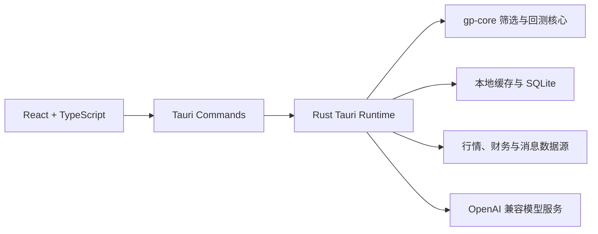

# 股选优

面向 A 股研究的跨平台选股、观察与回测工作台。项目使用 **Tauri 2 + Rust + React/TypeScript**，Windows 桌面端与 Android 端共享同一套界面和 Rust 核心能力。

> 股选优只提供研究、筛选和策略验证工具，不构成投资建议，不承诺任何收益。市场有风险，投资需谨慎。


## 下载与安装

请前往项目的 [GitHub Releases](https://github.com/tutict/gp-assistant/releases) 下载最新版：

- **Windows 10/11 x64**：下载名称以 `_x64-setup.exe` 结尾的安装程序。
- **Android 7.0 及以上**：下载名称以 `_android_aarch64_release_signed.apk` 结尾的安装包。

Android 安装时如果系统提示“未知来源应用”，请只为当前文件来源临时授权。升级安装必须使用相同签名的 APK；正式发布包会保留一致的应用签名。

## 主要能力

| 模块 | 能力 |
| --- | --- |
| 选股 | 按估值、盈利质量、成长、风险、市值、行业与市场状态筛选，提供质量、趋势、风险和综合评分 |
| 多策略筛选 | 支持基础筛选、行业/板块筛选、关系图筛选和趋势筛选，并可将结果加入自选池 |
| 个股观察 | 汇总行情、总股本、流通股、EPS、财务质量、机构资金、量价状态和专业量化明细 |
| K 线与指标 | 支持日 K、周 K、月 K，显示均线、MACD、KDJ、成交量、十字定位、缩放和手机横向全屏 |
| 研究摘要 | 首屏提炼资金背离、趋势效率、波动状态和流动性风险，原始指标保留在专业明细中 |
| 回测 | 支持条件候选池或自选池回测、等权组合、调仓、成本扣减和严格滚动样本外验证 |
| 新闻与证据 | 聚合个股消息、上下游关系和本地 RAG 证据，区分来源、时间与正负面线索 |
| 研究 Agent | 调用筛选、观察、回测和消息工具，以聊天方式组织证据并解释结果 |
| 模型配置 | 支持 OpenAI 兼容接口、硅基流动和本地模型服务，可先拉取供应商模型列表再选择默认模型 |
| 数据维护 | 查看股票池与缓存状态，联网更新数据，并在收盘后进行刷新检查 |

## 设计与数据原则

- **证据优先**：结果尽可能展示数据来源、更新时间、缺失项和可复核明细。
- **中国市场语义**：图表使用红涨、绿跌、灰平，方向信息同时配合文字或数值表达。
- **缺失不伪造**：无法取得的数据保持缺失状态或使用明确标注的代理指标，不用虚构值补齐。
- **桌面与移动同源**：前端唯一源码位于 `desktop/frontend/`，桌面端和 Android 端使用相同业务组件。
- **本地优先**：自选、缓存和研究数据优先保存在本机；密钥与签名配置不应提交到仓库。

核心股票池、日线和分钟线能力以通达信与腾讯行情链路为主；观察、财务和消息模块会按数据可用性补充公开来源。外部数据可能延迟、缺失或调整口径，使用结论前应核对原始公告和交易所信息。

## 严格滚动样本外回测

Walk-forward 回测把每个调仓日至下一调仓日视为独立样本外区间，固定当期可见数据后再筛选和计分，以降低未来函数和幸存者偏差：

- 因子快照必须包含所属报告期和实际可见日期。
- 历史候选必须记录当时的上市、ST 和可交易状态。
- 入选标的缺少区间末真实报价时不会被静默剔除。
- 缺少行情、快照覆盖或必要字段时会明确失败，不使用当前财务数据或陈旧价格回填。
- 结果包含逐折明细、组合收益、基准对比和 `Precision@N` 等验证指标。

这些约束会降低“漂亮但不可复现”的回测结果，更适合用于筛选规则迭代和发布前验证。

### 回测波动率快照

回测结果按区间末最后一个可见交易日，为候选快照标的或 Walk-forward 末次调仓目标计算六项逐股诊断；它们只解释区间末的波动结构，不参与历史选股、调仓或收益计算：

- `ATR14`：真实波幅取 `max(高-低, |高-前收|, |低-前收|)`，使用 Wilder 14 日平滑，同时返回占收盘价比例。
- `布林带 20/2`：20 日收盘均值加减 2 倍总体标准差，并返回带宽与 `%B`。
- `唐奇安通道 20`：20 日最高价与最低价形成上下轨，并返回通道宽度与收盘位置。
- `凯尔特纳通道 20/10/2`：20 日 EMA 加减 2 倍 `ATR10`，并返回通道宽度与收盘位置。
- `Chaikin 10/10`：高低价差的 10 日 EMA 相对 10 个交易日前的变化率。
- `RVI14`：14 日收盘标准差按涨跌方向拆分，再以 Wilder 14 日平滑得到 0–100 的相对波动率指数。

原始输入只使用回测区间内的日线 OHLC。某项所需窗口不足、高低价缺失、OHLC 不一致、价格无效或分母为零时，该项保持缺失并返回具体原因；系统不会压缩无效日期、用收盘价伪造高低价，或输出 `NaN` 与无穷值。

## 模型配置

研究 Agent 支持 OpenAI Chat Completions 兼容接口。推荐在应用的模型设置中完成配置：

1. 新建模型连接并选择供应商类型。
2. 填写接口地址和 API Key；本地模型通常不需要 Key。
3. 点击拉取按钮获取供应商返回的模型列表。
4. 从列表中选择默认模型并保存。

也可以使用环境变量提供默认配置：

```text
OPENAI_API_KEY
OPENAI_MODEL
OPENAI_BASE_URL
OPENAI_TEMPERATURE
OPENAI_TIMEOUT_SECONDS
OPENAI_JSON_MODE=false
```

API Key 只应保存在受信任的本机环境中。不要把 `.env`、Android 签名文件或任何密钥提交到版本库。

## 技术架构



- `desktop/frontend/`：React/TypeScript 界面，Windows 与 Android 共用。
- `desktop/src-tauri/`：Tauri 壳、Rust commands、网络与本地存储适配。
- `native/gp-core/`：筛选、评分、趋势、关系图和回测核心库。
- `app/prompts/`：Agent 约束和移动端技能说明。
- `docs/`：数据、RAG 和工程设计文档。
- `scripts/`：开发、发布检查、桌面资源准备和 Android 构建脚本。

项目当前不依赖 Python/FastAPI 运行时，主要运行链路已统一到 Tauri + Rust。

## 本地开发

### 环境要求

- Windows 10/11
- Node.js 与 npm
- Rust stable toolchain
- Tauri 2 所需的 Windows WebView2/构建环境
- Android 构建额外需要 JDK 17 或 21、Android SDK 和 Android NDK

首次拉取后安装依赖：

```powershell
cd desktop
npm install
cd frontend
npm install
```

启动桌面开发环境：

```powershell
.\start-tauri-dev.bat
```

或者：

```powershell
cd desktop
npm run dev -- --no-watch
```

## 测试与发布检查

运行前端测试：

```powershell
cd desktop\frontend
npm test
```

运行 Rust 测试：

```powershell
cargo test --manifest-path native/gp-core/Cargo.toml
cargo test --manifest-path desktop/src-tauri/Cargo.toml
```

运行完整发布检查：

```powershell
powershell -NoProfile -ExecutionPolicy Bypass -File scripts\release-check.ps1
```

该检查会执行前端生产构建、Rust 测试、Tauri `cargo check` 和 Android 环境预检。

## 构建安装包

Windows NSIS 安装包：

```powershell
cd desktop
npm run build:windows
```

Android 初始化与预检：

```powershell
powershell -NoProfile -ExecutionPolicy Bypass -File scripts\build-android.ps1 -InitOnly
powershell -NoProfile -ExecutionPolicy Bypass -File scripts\build-android.ps1 -PreflightOnly
```

构建并签名 Android aarch64 Release APK：

```powershell
powershell -NoProfile -ExecutionPolicy Bypass -File scripts\build-android.ps1 -Signed -Target aarch64
```

本地签名配置位于被 Git 忽略的 `desktop/src-tauri/keys/`。请妥善备份 keystore；丢失签名密钥后无法对已安装应用进行原签名升级。

## 常用运行配置

| 变量 | 说明 |
| --- | --- |
| `TDX_CACHE` | 通达信股票池缓存路径，默认 `data/cache/tdx_stocks.csv` |
| `TDX_REFRESH=true` | 强制刷新股票池 |
| `TDX_HOSTS` | 指定通达信服务器，例如 `host1:7709,host2:7709` |
| `TDX_TIMEOUT` | 通达信连接超时秒数 |
| `TDX_TENCENT_BATCH_SIZE` | 腾讯批量行情请求大小 |
| `STOCK_PROXY_MODE=system\|none` | 行情请求是否使用系统代理 |

## 参与开发

提交改动前请至少执行与改动范围对应的测试；涉及发布、Rust/Tauri 或移动端资源时，建议运行完整 `scripts/release-check.ps1`。新增指标应同时说明公式、原始输入、缺失值策略和适用边界，并为关键计算补充回归测试。

## 风险声明

本项目中的筛选分数、量化指标、新闻情绪、回测结果和 Agent 输出均仅供研究参考，不是买卖建议、目标价、仓位建议或收益承诺。历史表现不代表未来结果，用户应独立核验数据并自行承担决策风险。
