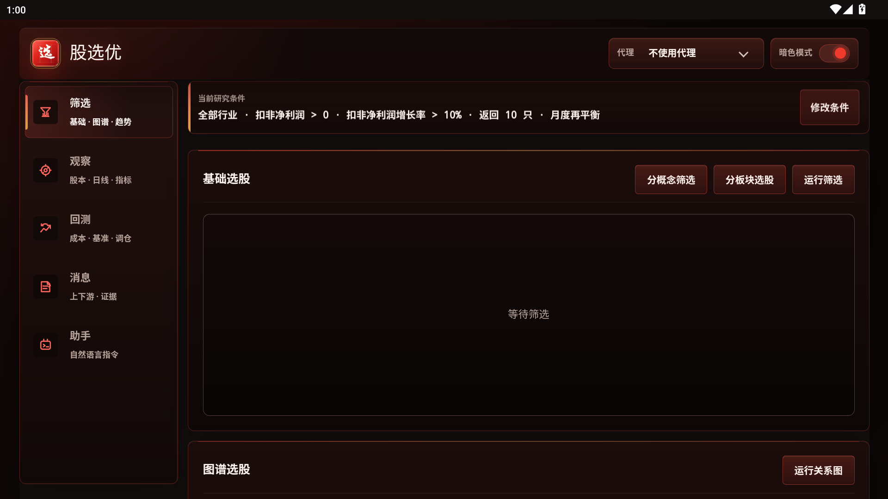
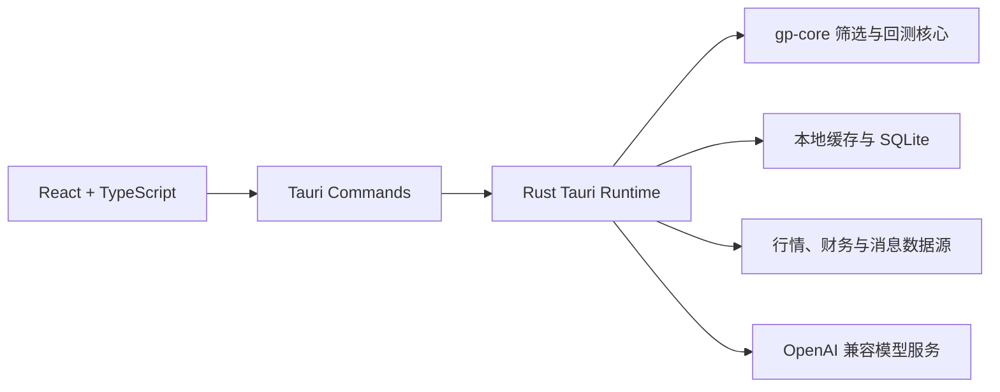

# 股选优

**股选优**是一款面向 A 股研究的跨平台工作台，将智能选股、个股观察、严格样本外回测、新闻与本地 RAG 证据、研究 Agent 集成在同一套工作流中。用户可以从市场与行业范围筛选候选标的，查看行情和量化诊断，将当前条件带入回测，再由 Agent 组织工具调用、证据和研究结论。

项目使用 **Tauri 2 + Rust + React/TypeScript**，Windows 桌面端与 Android 端共享界面和 Rust 核心能力。当前稳定版本为 **v0.6.2**：Agent 无模型时可回退本地工具，新闻工具统一读取 ResearchStore 证据，消息中心交互与视觉基线得到补强，并完善了 Windows/Android 发布资产门禁。

> 股选优只提供研究、筛选和策略验证工具，不构成投资建议，不承诺任何收益。市场有风险，投资需谨慎。



## 下载与安装

请前往 [股选优 v0.6.2](https://github.com/tutict/gp-assistant/releases/tag/v0.6.2) 下载当前稳定版，或在 [GitHub Releases](https://github.com/tutict/gp-assistant/releases) 查看全部版本：

- **Windows 10/11 x64**：下载名称以 `_windows_x64_setup.exe` 结尾的安装程序。
- **Android 7.0 及以上**：下载名称以 `_android_aarch64_release_signed.apk` 结尾的安装包。

Android 安装时如果系统提示“未知来源应用”，请只为当前文件来源临时授权。升级安装必须使用相同签名的 APK；正式发布包会保留一致的应用签名。

## 主要能力

| 模块 | 能力 |
| --- | --- |
| 选股 | 按估值、盈利质量、成长、风险、市值、行业与市场状态筛选，提供质量、趋势、风险和综合评分 |
| 多策略筛选 | 提供智能选股、概念分组、板块分组、自定义选股和趋势选股五种模式，界面默认使用 adaptive_swing_v1，结果可加入自选池 |
| 个股观察 | 汇总行情、总股本、流通股、EPS、财务质量、机构资金、量价状态和专业量化明细 |
| K 线与指标 | 支持日 K、周 K、月 K，显示均线、MACD、KDJ、成交量、十字定位、缩放和手机横向全屏 |
| 研究摘要 | 首屏提炼资金背离、趋势效率、波动状态和流动性风险，原始指标保留在专业明细中 |
| 回测 | 支持条件候选池或自选池回测、等权组合、调仓、成本扣减和严格滚动样本外验证 |
| 新闻与证据 | 聚合个股消息、上下游关系和本地 RAG 证据，区分来源、时间与正负面线索 |
| 研究 Agent | 调用筛选、观察、回测和消息工具，以聊天方式组织证据并解释结果；运行记录可通过复盘抽屉查看事件时间线、工具调用和最终结果 |
| 模型与界面设置 | 支持 OpenAI Chat Completions、OpenAI Responses、Anthropic Messages、兼容网关和本地模型服务；主题、界面密度和字体缩放可持久化保存 |
| 数据维护 | 查看股票池与缓存状态，联网更新数据并在收盘后检查刷新；报价快照不完整时会继续补取 |

## 设计与数据原则

- **证据优先**：结果尽可能展示数据来源、更新时间、缺失项和可复核明细。
- **中国市场语义**：图表使用红涨、绿跌、灰平，方向信息同时配合文字或数值表达。
- **缺失不伪造**：无法取得的数据保持缺失状态或使用明确标注的代理指标，不用虚构值补齐。
- **桌面与移动同源**：前端唯一源码位于 `desktop/frontend/`，桌面端和 Android 端使用相同业务组件。
- **本地优先**：自选、缓存和研究数据优先保存在本机；密钥与签名配置不应提交到仓库。

核心股票池、日线和分钟线能力以通达信与腾讯行情链路为主；观察、财务和消息模块会按数据可用性补充公开来源。外部数据可能延迟、缺失或调整口径，使用结论前应核对原始公告和交易所信息。

## 自适应波段选股

“智能选股”已实现 adaptive_swing_v1，面向 10–30 个交易日的波段研究。运行时先按财务质量、估值、流动性和数据完整度构建最多 80 只候选池，再结合上证综指、深证成指、创业板指与全市场宽度识别趋势、震荡、防守或过渡状态。概念标签只用于结果解释和探索榜分散，不直接加分。

- 自动模式至少需要 2 个有效宽基指数；候选历史覆盖不足 60% 时明确失败，不输出补默认值的榜单。
- 主榜默认 10 只、单行业最多 3 只；探索榜兼顾原始分、差异度与最近 5 个交易日的新颖度。
- 首次运行补取并缓存 120 日 OHLCV，进度事件使用 run_id 隔离；曝光记录保存在独立 SQLite 表中。
- 界面默认使用 `adaptive_swing_v1`。本地 SQLite 中的样本外发布门槛记录继续用于质量监控和发布验证，但不会让普通选股请求静默回退到 `legacy_balanced`；后者只接受显式兼容请求。
- 发布资格只接受自动模式、全市场无附加过滤、Top 10、月度调仓、10 bps 成本、候选等权基准且至少 60 个严格样本外折次的回测；通过记录绑定核心算法、Tauri 编排和发布契约的实现指纹，代码变化后必须重新验证。

## 严格滚动样本外回测

Walk-forward 回测把每个调仓日至下一调仓日视为独立样本外区间，固定当期可见数据后再筛选和计分，以降低未来函数和幸存者偏差：

- 因子快照必须包含所属报告期和实际可见日期。
- 历史候选必须记录当时的上市、ST 和可交易状态。
- 入选标的缺少区间末真实报价时不会被静默剔除。
- 缺少行情、快照覆盖或必要字段时会明确失败，不使用当前财务数据或陈旧价格回填。
- 结果包含逐折明细、组合收益、基准对比和 `Precision@N` 等验证指标。
- adaptive_swing_v1 回测会在同一份点时数据上同时运行旧 `balanced` walk-forward 对照，并返回发布门槛逐项结果；运行时只汇总当前实现中自动模式、全市场无附加过滤、10+10 榜单和 10–30 日周期的发布验证运行，并从 SQLite 计算过去 30 天内每个连续五次窗口的最低主榜+探索榜覆盖，以及未命中缓存/命中缓存的最慢端到端时延。人工模式与自定义条件运行不会污染发布证据；任何证据未采集时门槛保持未通过，后续慢运行或低覆盖窗口会自动重算并撤销已有放行。

这些约束会降低“漂亮但不可复现”的回测结果，更适合用于筛选规则迭代和发布前验证。

从智能选股结果进入回测时，会携带完整的 adaptive_swing_v1 规格。每个调仓执行日使用前一交易日收盘前已公开的财务快照、行情、宽基指数和市场宽度重新判断状态，再于下一交易日成交，禁止复用今天的市场状态、未来数据或用同一收盘价同时生成信号并成交。

### adaptive_swing_v1 发布验证

> **v0.6.2 状态：数据未就绪、尚未验证。** 当前可用数据不包含覆盖回测区间的全市场点时（PIT）历史因子、上市、ST 与可交易状态，因此本版本不宣称 adaptive 严格发布门槛已经通过。严格回测语义保持不变：缺少 `factor_snapshots` 等必要证据时会在历史行情预取前明确失败，不使用当前数据回填；普通 `candidate_snapshot` 回测仍可正常使用。完整 PIT 数据采集作为后续独立工作，不阻塞 v0.6.2 依据 `scripts/release-check.ps1` 完成常规发布检查。

发布验证前必须准备覆盖回测区间的全市场日线，以及带报告期和实际可见日期的历史因子快照；只有当前单期财务快照时，不能形成至少 60 个严格样本外折次的有效证据。

先从 desktop/ 启动带 WebView2 调试端口的桌面开发版：

~~~powershell
cd desktop
$env:WEBVIEW2_ADDITIONAL_BROWSER_ARGUMENTS="--remote-debugging-port=9223"
npm run dev
~~~

然后在仓库根目录运行：

~~~powershell
node scripts/validate-adaptive-release.mjs
~~~

脚本会依次采集一次真实冷启动、四次同日缓存运行，执行符合发布资格的严格回测，并确认默认路由已切换到 adaptive_swing_v1。任一检查失败时脚本以非零状态退出，不会手工写入或伪造通过报告。代码指纹变化后可使用 --screens-only 只重采五次运行证据；补齐数据后可使用 --backtest-only 只重跑回测，也可通过 --end-date YYYYMMDD 固定验证截止日。


### 回测波动率快照

回测结果按区间末最后一个可见交易日，为候选快照标的或 Walk-forward 末次调仓目标计算六项逐股诊断；它们只解释区间末的波动结构，不参与历史选股、调仓或收益计算：

- `ATR14`：真实波幅取 `max(高-低, |高-前收|, |低-前收|)`，使用 Wilder 14 日平滑，同时返回占收盘价比例。
- `布林带 20/2`：20 日收盘均值加减 2 倍总体标准差，并返回带宽与 `%B`。
- `唐奇安通道 20`：20 日最高价与最低价形成上下轨，并返回通道宽度与收盘位置。
- `凯尔特纳通道 20/10/2`：20 日 EMA 加减 2 倍 `ATR10`，并返回通道宽度与收盘位置。
- `Chaikin 10/10`：高低价差的 10 日 EMA 相对 10 个交易日前的变化率。
- `RVI14`：14 日收盘标准差按涨跌方向拆分，再以 Wilder 14 日平滑得到 0–100 的相对波动率指数。

原始输入只使用回测区间内的日线 OHLC。某项所需窗口不足、高低价缺失、OHLC 不一致、价格无效或分母为零时，该项保持缺失并返回具体原因；系统不会压缩无效日期、用收盘价伪造高低价，或输出 `NaN` 与无穷值。

## 模型配置

研究 Agent 支持 OpenAI Chat Completions、OpenAI Responses 和 Anthropic Messages 上游协议。推荐在应用的模型设置中完成配置：

1. 新建模型连接并选择供应商类型。
2. 填写基础地址或完整请求 URL、API Key 和模型 ID；本地模型通常不需要 Key。
3. 模型 ID 可以直接填写，也可以点击拉取按钮从供应商返回列表中选择。
4. 使用“测试连接”验证当前协议、地址、鉴权和模型是否能够完成真实推理。
5. 按需在高级选项中设置协议、自定义 User-Agent、温度、超时和 JSON 模式，然后保存。

专家和研报模式只会使用应用内显式保存并传入的模型连接，不会从环境变量自动调用外部服务。新闻 RAG 等兼容路径可以使用环境变量提供默认配置：

```text
OPENAI_API_KEY
OPENAI_MODEL
OPENAI_BASE_URL
OPENAI_TEMPERATURE
OPENAI_TIMEOUT_SECONDS
OPENAI_JSON_MODE=false
```

API Key 只应保存在受信任的本机环境中。不要把 `.env`、Android 签名文件或任何密钥提交到版本库。

## 技术架构



- `desktop/frontend/`：React/TypeScript 界面，Windows 与 Android 共用。
- `desktop/src-tauri/`：Tauri 壳、Rust commands、网络与本地存储适配。
- `native/gp-core/`：筛选、评分、趋势、关系图和回测核心库。
- `app/prompts/`：Agent 约束和移动端技能说明。
- `docs/`：Agent、RAG、移动端与迁移审计技术文档。
- `scripts/`：开发、发布检查、桌面资源准备和 Android 构建脚本。

项目当前不依赖 Python/FastAPI 运行时，主要运行链路已统一到 Tauri + Rust。

## 本地开发

### 环境要求

- Windows 10/11
- Node.js 20.19+（20.x）或 22.12+，以及 npm
- Rust stable toolchain
- Tauri 2 所需的 Windows WebView2/构建环境
- Android 构建额外需要 JDK 17 或 21、Android SDK 和 Android NDK

首次拉取后安装依赖：

```powershell
cd desktop
npm install
cd frontend
npm install
```

启动桌面开发环境：

```powershell
.\start-tauri-dev.bat
```

或者：

```powershell
cd desktop
npm run dev -- --no-watch
```

## 测试与发布检查

运行前端测试：

```powershell
cd desktop\frontend
npm test
```

运行 Rust 测试：

```powershell
cargo test --manifest-path native/gp-core/Cargo.toml
cargo test --manifest-path desktop/src-tauri/Cargo.toml
```

运行完整发布检查：

```powershell
powershell -NoProfile -ExecutionPolicy Bypass -File scripts\release-check.ps1
```

该检查会执行前端生产构建、Rust 测试、Tauri `cargo check`、Android 环境预检，并实际构建 Windows NSIS 与已签名 Android aarch64 APK。只运行代码与界面门禁时可显式传入 `-SkipPackageBuild`；仅供本地诊断的无签名 Android 构建需显式传入 `-AllowUnsignedAndroid`。

## 构建安装包

Windows NSIS 安装包：

```powershell
cd desktop
npm run build:windows
```

Android 初始化与预检：

```powershell
powershell -NoProfile -ExecutionPolicy Bypass -File scripts\build-android.ps1 -InitOnly
powershell -NoProfile -ExecutionPolicy Bypass -File scripts\build-android.ps1 -PreflightOnly
```

构建并签名 Android aarch64 Release APK：

```powershell
powershell -NoProfile -ExecutionPolicy Bypass -File scripts\build-android.ps1 -Signed -Target aarch64
```

本地签名配置位于被 Git 忽略的 `desktop/src-tauri/keys/`。请妥善备份 keystore；丢失签名密钥后无法对已安装应用进行原签名升级。

## 常用运行配置

| 变量 | 说明 |
| --- | --- |
| `TDX_CACHE` | 通达信股票池缓存路径，默认 `data/cache/tdx_stocks.csv` |
| `TDX_REFRESH=true` | 强制刷新股票池 |
| `TDX_HOSTS` | 指定通达信服务器，例如 `host1:7709,host2:7709` |
| `TDX_TIMEOUT` | 通达信连接超时秒数 |
| `TDX_TENCENT_BATCH_SIZE` | 腾讯批量行情请求大小 |
| `STOCK_PROXY_MODE=system\|none` | 行情请求是否使用系统代理 |

## 参与开发

提交改动前请至少执行与改动范围对应的测试；涉及发布、Rust/Tauri 或移动端资源时，建议运行完整 `scripts/release-check.ps1`。新增指标应同时说明公式、原始输入、缺失值策略和适用边界，并为关键计算补充回归测试。

## 风险声明

本项目中的筛选分数、量化指标、新闻情绪、回测结果和 Agent 输出均仅供研究参考，不是买卖建议、目标价、仓位建议或收益承诺。历史表现不代表未来结果，用户应独立核验数据并自行承担决策风险。
