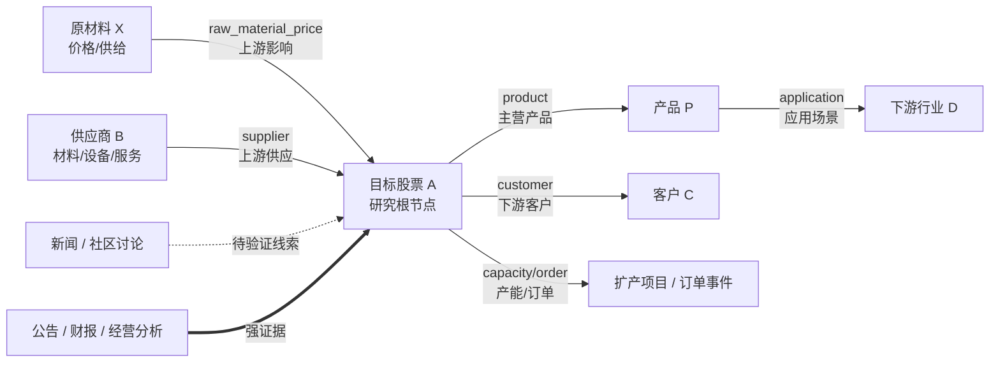

# 移动端上下游 RAG 同步设计

本文档固化桌面端构建、手机端扫码导入的第一期边界。目标不是做全市场知识库，而是围绕单个目标股票构建一跳上下游证据链。

## 目标

- 以目标股票为根节点，构建直接上游、直接下游、客户、供应商、产品、应用、产能、订单、价格影响关系。
- 桌面端负责采集、解析、关系抽取、质量检查、打包和局域网传输。
- 手机端负责扫码导入、轻量检索、关系图展示、证据浏览和版本回滚。
- 第一阶段不在手机端做长期 RAG 构建，不内置 ONNX Runtime Mobile 向量查询。

## 非目标

- 不做全市场全量抓取。
- 不做二跳上下游自动扩展。
- 不让社区内容直接影响事实置信度。
- 不把东方财富作为公告、财报事实主链路。
- 不把 AkShare/Python 生态塞进 APK。

## 信源分层

`filing` 是最高可信层，主源是 CNINFO/巨潮、交易所公告、公司披露和财报摘要。第一期通过 AkShare 的 CNINFO 披露接口接入，并保留手动公告 URL 导入兜底。

`financial_snapshot` 是财务快照层，通达信 F10 和 `finance_info` 可提供公司资料、财务摘要、经营分析补充。它不能替代公告原文和财报原文。

`news` 是传统媒体和个股新闻层，可作为事实线索，但必须保留来源、发布时间和原文片段。第一期可接入东方财富个股新闻、第一财经等手动 URL。

`research` 是研报摘要层，只作为观点和预测线索，不直接提升为官方事实。

`community` 是社区讨论层，包括雪球、东方财富股吧。它只能进入待验证线索池，不能单独形成利好、利空或上下游事实结论。

## 关系方向

关系方向固定为目标股票视角。



每条关系边必须保留原文证据，证据挂在边上，而不是只挂在节点上。

## 关系状态

- `confirmed`：公告、财报、经营分析明确证明。
- `supported`：传统媒体、个股新闻、研报摘要支持，但不是官方披露。
- `inferred`：LLM 从文本中提取，有证据片段，但未被官方信源确认。
- `rumor`：社区讨论和未验证传闻，只能折叠到待验证线索。

默认展示顺序是 `confirmed > supported > inferred > rumor`。桌面端每个方向最多展示 20 条边，手机端每个方向最多展示 8 条边。

## SQLite 包结构

第一版 `rag_pack.sqlite` 使用固定 schema：

- `pack_meta`：目标股票、版本、构建时间、sha256、统计信息。
- `source_documents`：公告、财报、新闻、研报、社区、手动 URL 来源记录。
- `evidence_chunks`：可被引用的证据片段。
- `relation_entities`：目标股票、供应商、客户、产品、行业、原材料等节点。
- `relation_edges`：上下游关系边，包含方向、状态、置信度、证据引用。
- `light_search_index`：手机端轻量检索字段，包括关键词、股票代码、行业、关系类型。

第一期不放向量表。ONNX Runtime Mobile 跑通后再追加移动端向量表，不改现有轻量检索字段。

## 版本规则

包版本号格式：

```text
股票代码_数据截止日期_构建时间_短sha256
```

示例：

```text
300750.SZ_2026-06-08_153012_a1b2c3d4
```

manifest 必须记录目标股票代码、名称、数据截止日期、构建时间、文档数、证据数、关系边数、来源分层统计、sha256 和文件大小。

## 质量门禁

构建前必须执行证据质量检查。

- 必须有目标股票代码和名称。
- 必须有至少 1 条 `filing` 或 `news` 证据。
- 必须存在 `confirmed` 或 `supported` 关系边。
- 所有关系边必须有 `evidence_text` 和 `source_ref`。
- `metadata_only` 可以入包，但不能算作可回答事实证据。
- 不能包含测试数据源标记。
- manifest 的 sha256 必须与实际文件一致。

检查失败时只允许保存草稿，不允许扫码同步到手机。如果只有社区内容或测试数据，禁止生成有效同步包。

## 扫码导入

桌面端生成 `manifest.json` 和 `rag_pack.sqlite` 后，临时开启同一局域网下载地址。

手机端扫码后必须校验：

- 一次性 token。
- 过期时间。
- 文件大小。
- sha256。
- `valid=true`。
- `document_count > 0`。

导入采用原子替换。手机端保留上一个成功版本作为回滚版本。

## 桌面端流程

```text
选择目标股票 -> 采集/导入信源 -> 构建上下游关系 -> 质量检查 -> 生成 RAG 包 -> 扫码同步手机
```

只有质量检查通过后才显示扫码同步入口。

## 手机端流程

- `RAG包列表`：显示目标股票、版本、更新时间、文档数、关系边数、状态。
- `扫码导入`：只支持同一局域网临时链接。
- `上下游图谱`：默认展示 `confirmed/supported` 的 Top N 边。
- `证据列表`：按公告、财报、新闻、社区分层。
- `待验证线索`：折叠展示 `inferred/rumor`。
- `回滚版本`：保留上一个成功导入版本。
